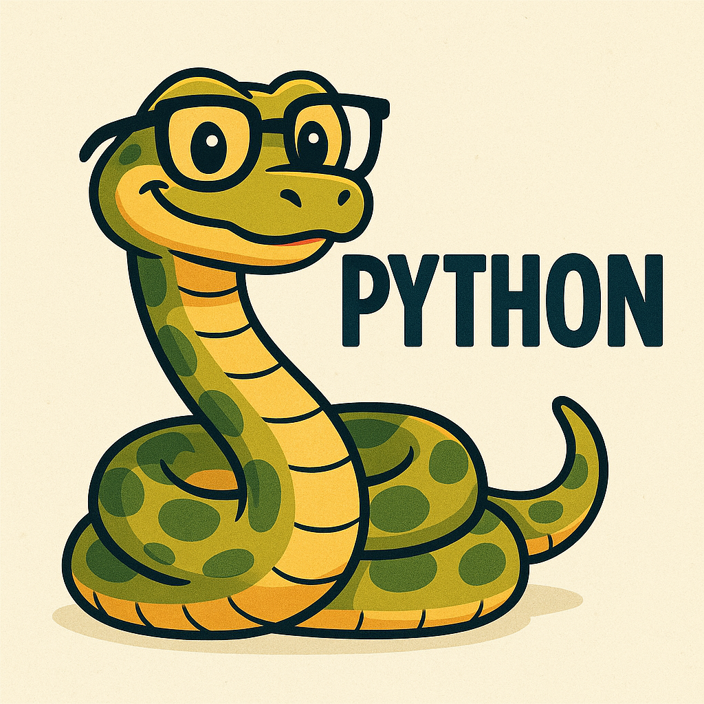

# Esse joguinho foi feito com inspiração num projeto do [codedex](https://github.com/codedex-io)

### Projeto original feito pelo usuário da codedex: Daniel Li [@realdanielli](https://www.codedex.io/@realdanielli)
### Nome do projeto original: [Build a Word Guessing Game with Python](https://www.codedex.io/projects/build-a-word-guessing-game-with-python)

 

# Esse joguinho está usando:
### [Coleção de dicionários em Portugues (pt-BR)](https://github.com/fserb/pt-br) do Fernando Serboncini: [@fserb](https://github.com/fserb)
###### Ao qual este está sobre a [licença MIT](DICTIONARY-LICENSE.txt)

 

### Aqui eu perdendo lol:

